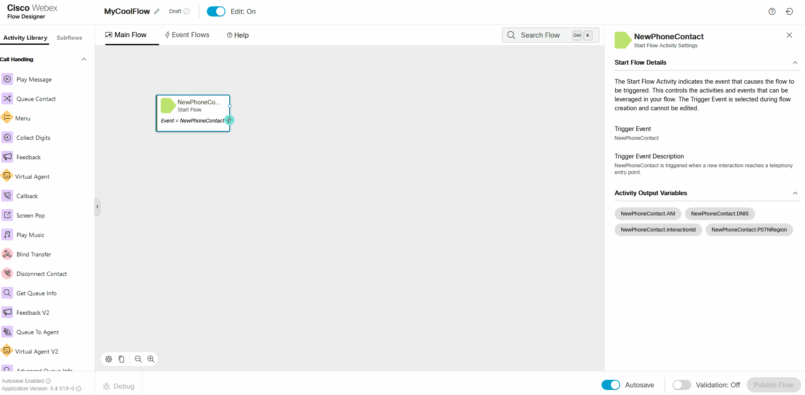
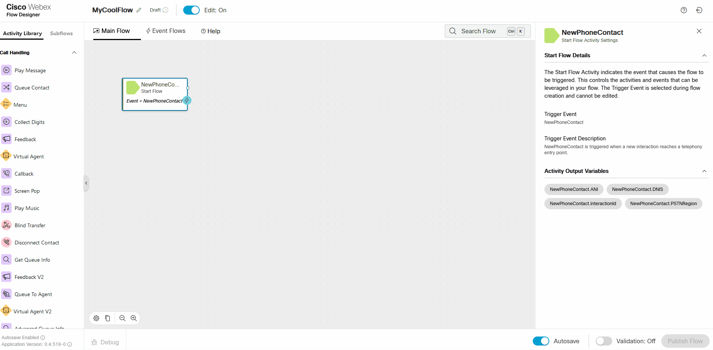
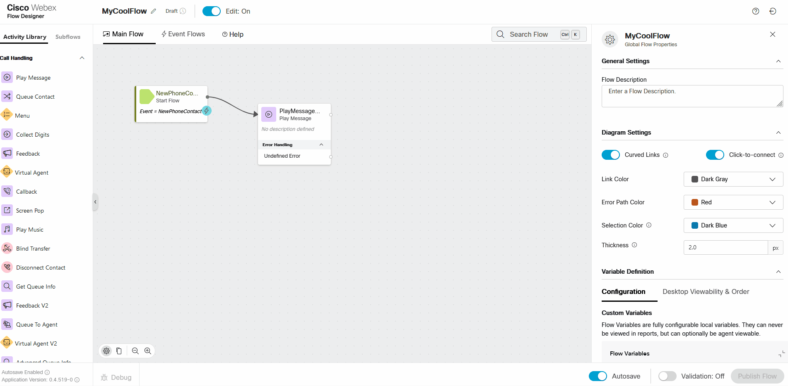

# Cheat Sheet

## 

Assign a Flow to an Inbound Number (Map a Channel)

## 

Create a New Flow

## 

Create Flow Variables

## 

Add Global Variables to a Flow

## 

Add a Node to a Flow

## 

Add a Subflow to a Flow

