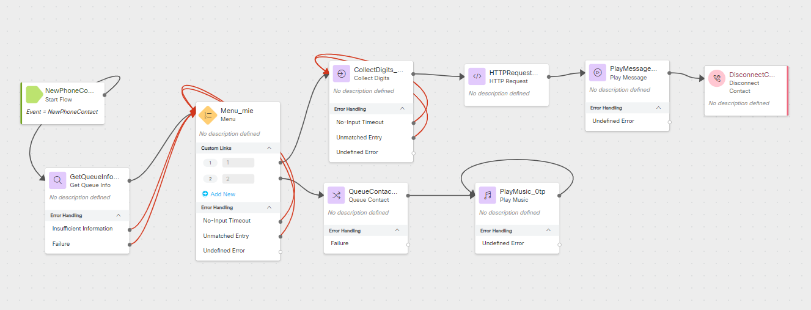

# Creating a Self Service Support Option in an Emergency  

## Story
> It is July 19, 2024 and your IT department is starting their day off with a full call queue of users which are all reporting the same issue as 8.5 million other PC users, their PCs are crashing or will not boot.  Worst of all your IT team cannot remotely access they affected user's PC and must walk them through the remediation steps over the phone.  As fortune would have it, the required steps for remediation were quickly spreading across the internet.  Now you just need to walk your users through the remediation process so they can get back to work. 


### High Level Explanation
1. A Business Hours Override has already been configured and is currently being used to let callers know that there is a widespread event causing a higher than normal call volume.
2. Another team member has created a webhook flow in Connect to send an SMS message with instructions for resolving the issue and collect feedback from the customer regarding resolution status.
3. Create a new flow to handle the logic for the emergency event
      1. Inform callers that they will need to take actions on their PC to resolve the issue.
      2. Give callers the option to receive an SMS with a link to instructions or enter the queue as the X caller in queue.
      3. If they choose to receive the SMS, collect their SMS number and use a webhook to send them an SMS message.
      4. If they choose to wait in the queue, queue the call.  
4. After unit testing the new flow, edit the main flow changing the Play Message option into a Menu and a go to flow node 

## Preconfigured elements
1. Existing main flow for the IT department
2. Business Hours
3. Business Hours Overrides
4. Webhook for sending SMS

## Build

### Create a new Flow
> Create a flow named <copy><w class="POD">yourLabID</w>_CrowdStrikeHelp</copy>

---

### Add a Get Queue Info node
> Connect the New Phone Contact to this Get Queue Info node
>
> Select: Static Queue
>
> Queue: <w class="Queue"></w>
>
> Lookback Time 
> > EWT Lookback: <copy>5</copy> Minutes

---

### Add a Menu node
> Connect the output, Insufficient Information, and Failure node edges this Menu node
>
> Enable Text-To-Speech
>
> Select the Connector: Cisco Cloud Text-to-Speech
>
> Click the Add Text-to-Speech Message button
>
> Delete the Selection for Audio File
>
> Text-to-Speech Message: <copy>In order to resolve this issue, you will need to follow several steps on your PC as a technician will not be able to remotely connect to your machine.  Resolving this issue should only take a few minutes. To receive a link to a video walk through via text message which will help you resolve this immediately, press 1.  To enter the queue as the {{GetQueueInfo_NODEID.CallsQueuedNow + 1}} call in the queue press 2.</copy>
>
> > In the Text-to-Speech Message replace GetQueueInfo_NODEID.CallsQueuedNow with the correct Get Queue Info output variable for Calls Queued Now.
>
> Select: Make Prompt Interruptible
>
> In Custom Menu Links:
>
> > Use the Add New button and the Digit Number selector to provide Options 1 and 2
>
> Connect the No-Input Timeout and Unmatched Entry node edges and connect them to the front of this Menu node

---

### Add a Collect Digits node
> Connect the 1 output node edge from the Menu node to this Collect Digits node
>
> Enable Text-To-Speech
>
> Select the Connector: Cisco Cloud Text-to-Speech
>
> Click the Add Text-to-Speech Message button
>
> Delete the Selection for Audio File
>
> Text-to-Speech Message: <copy>Please enter your 10 digit mobile phone number starting with the area code.</copy>
>
> Select: Make Prompt Interruptible
>
> In Advanced Settings
>
> > Minimum Digits: <copy>10</copy>
> >
> > Maximum Digits: <copy>10</copy>
>
> Connect the No-Input Timeout and Unmatched Entry node edges and connect them to the front of this Collect Digits node

---
### Add a Menu Node

> Connect the output node edge from the Collect Digits node to this Menu node
>
> Enable Text-To-Speech
>
> Select the Connector: Cisco Cloud Text-to-Speech
>
> Click the Add Text-to-Speech Message button
>
> Delete the Selection for Audio File
>
> Text-to-Speech Message: <copy>`<speak>You have entered <say-as interpret-as='telephone'>{{CollectDigits_NODEID.DigitsEntered}}</say-as>.  To receive an SMS message at this number, press 1.  To enter a different number, press 2. </speak>`</copy>
>
> > In the Text-to-Speech Message replace CollectDigits_NODEID.DigitsEntered with the correct Collect Digits output variable for Digits Entered.
>
> Select: Make Prompt Interruptible
>
> In Custom Menu Links:
>
> > Use the Add New button and the Digit Number selector to provide Options 1 and 2
>
> Connect the No-Input Timeout and Unmatched Entry node edges and connect them to the front of this Menu node
>
> Connect the 2 node edge output to the Collect Digits Node 

---

### Add an HTTP Request node
> Connect the 1 output node edge from the last Menu node to this HTTP Request node
>
> Turn off Use Authenticated Endpoint
>
> Request URL: <copy>https://hooks.us.webexconnect.io/events/IB8ZVWPJUL</copy>
>
> Method: POST
>
> Content Type: Application/JSON
>
> Request Body:
> 
```JSON
{
"ANI": "{{NewPhoneContact.ANI}}",
"sms": "+1{{CollectDigits_NODEID.DigitsEntered}}",
"taskID": "{{NewPhoneContact.interactionId}}"
}
```
>> In the request body, replace CollectDigits_NODEID.DigitsEntered with the correct Collect Digits output variable for Digits Entered.
>

---


### Add A Play Message node
> Connect the output node edge from the HTTP Request node to this Play Message node
>
> Enable Text-To-Speech
>
> Select the Connector: Cisco Cloud Text-to-Speech
>
> Click the Add Text-to-Speech Message button
>
> Delete the Selection for Audio File
>
> Text-to-Speech Message: <copy>You should receive a text message with a link to instructions for resolving the issue within a few minutes.  Goodbye.</copy>
>
> Connect the output node edge from this node to the Disconnect Contact node added in the next step.

---

### Add a Disconnect Contact node


---


### Add a Queue Contact node
> Connect the 2 output node edge from the first menu node to this Queue Contact node.
>
> Select Static Queue
>
> Queue: <w class="Queue">yourQueueID</w>
> 

---


### Add a Play Music node
> Connect the output from the Queue Contact node to this Play Music node
>
> Select Static Audio File
>
> Music File: defaultmusic_on_hold_cisco_opus_no_1.wav
>
> Connect the output node edge to the front of this Play Music Node

---

### <details><summary>Check your flow</summary></details>

---

### Publish your flow
> Turn on Validation at the bottom right corner of the flow builder
>
> If there are no Flow Errors, Click Publish
>
> Add a publish note
>
> Add Version Label(s): Live 
>
> Click Publish Flow

 
---


### Map your flow to your inbound channel
> Navigate to Control Hub > Contact Center > Channels
>
> Locate your Inbound Channel (you can use the search): <copy><w class="EPname"></w></copy>
>
> Select the Routing Flow: <copy><w class="POD"></w>_CrowdStrikeHelp</copy>
>
> Select the Version Label: Live
>
> Click Save in the lower right corner of the screen


---

## Unit Test the Flow


---


## Edit the CrowdStrike_Starter Flow
> Open the flow: <copy><w class="POD"></w>_CrowdStrikeStarter</copy>

---

### Replace the Play Message node which we put in once we identified the event with a Menu node

---

### Add a Go To node

---

### Publish the Flow Using the Test Tag
> Turn on Validation at the bottom right corner of the flow builder
>
> If there are no Flow Errors, Click Publish
>
> Add a publish note
>
> Add Version Label(s): Test 
>
> Click Publish Flow
> 
---

### Map your flow to your inbound channel
> Navigate to Control Hub > Contact Center > Channels
>
> Locate your Inbound Channel (you can use the search): <copy><w class="EPname"></w></copy>
>
> Select the Routing Flow: <copy><w class="POD"></w>_CrowdStrikeStarter</copy>
>
> Select the Version Label: Live
>
> Click Save in the lower right corner of the screen

## Dev Testing
1. Take option 1
2. Take option 2
3. Enter no selection

---

### Publish the flow with the Live Tag
> Turn on Validation at the bottom right corner of the flow builder
>
> If there are no Flow Errors, Click Publish
>
> Add a publish note
>
> Add Version Label(s): Live 
>
> Click Publish Flow
>

---

### Map your flow to your inbound channel
> Navigate to Control Hub > Contact Center > Channels
>
> Locate your Inbound Channel (you can use the search): <copy><w class="EPname"></w></copy>
>
> Select the Routing Flow: <copy><w class="POD"></w>_CrowdStrikeStarter</copy>
>
> Select the Version Label: Live
>
> Click Save in the lower right corner of the screen

---

## Smoke Test
1. Take option 1
2. Take option 2
3. Enter no selection


---


<script src='../assets/load.js'><script>